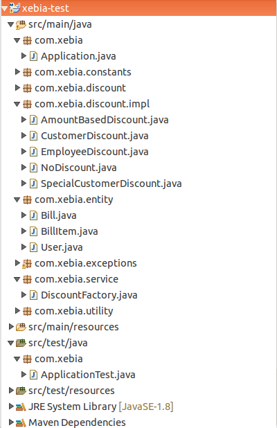

# Discount Calculator

Purpose of this application is to find the net payable amount on a given bill by validating the items and user on several conditions.

The following discounts may apply:

1. If the user is an employee of the store, he gets a 30% discount
2. If the user is an affiliate of the store, he gets a 10% discount
3. If the user has been a customer for over 2 years, he gets a 5% discount.
4. For every $100 on the bill, there would be a $ 5 discount (e.g. for $ 990, you get $ 45
as a discount).
5. The percentage based discounts do not apply on groceries.
6. A user can get only one of the percentage based discounts on a bill.

## Project Structure

### Application.java

This class is the root class to handle all the discount related operations on the provided bill. A chain of responsibility is being implemented in this class which process a provided bill and pass it through several services to find the net payable amount.

### Discount.java

Common interface to be implemented by all the type of discounts. There are five implementations of this interface in this project

1. AmountBasedDiscount.java
2. CustomerDiscount.java
3. EmployeeDiscount.java
4. NoDiscount.java
5. SpecialCustomerDiscount.java

### DiscountFactory.java

Factory class to generate discount type objects on the basis of user type.

AmountBasedDiscount object will be created for each bill. The class is implemented in such a way that For every $100 on the bill, there would be a $ 5 discount (e.g. for $ 990, you get $ 45 as a discount). The amount value and discount value can be changed in the Constants.java file.

CustomerDiscount object will be created only if the user type is customer.

EmployeeDiscount object will be created only if the user type is employee.

SpecialCustomerDiscount object will be created only if the user is of type customer and if he/she is a customer sof the store since last 2 years or more.

## Entities

1. User
2. Bill
3. BillItem
